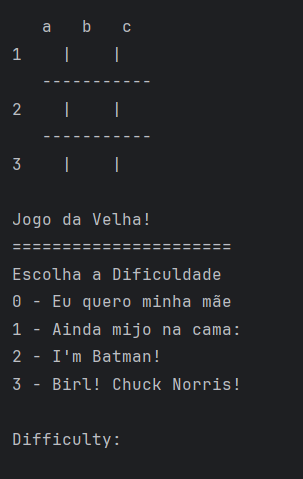
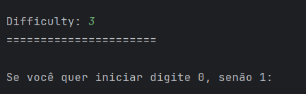
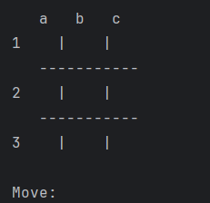
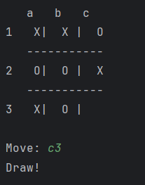

<h1 align="center">Tic Tac in Python</h1>

Overview:
=================

Introduction to Artificial Intelligence. Implementation of the old-fashioned game in Python language, for the Artificial Intelligence course.

Tic-tac-toe, despite its simplicity, is a classic testing ground for artificial intelligence. By developing an AI to play tic-tac-toe, programmers can explore fundamental concepts of decision-making and strategy in a controlled environment.

One of the most widely used algorithms to create an unbeatable AI at tic-tac-toe is minimax. This technique allows the machine to explore all possible sequences of moves, assigning values ​​to each state of the game and always choosing the option that maximizes its chances of winning or minimizes the chances of losing.

<h3>How does minimax work?</h3>
=================

Game tree: The algorithm creates a tree where each node represents a possible game state.

State evaluation: Each leaf of the tree (final state) is evaluated: win, lose, or draw.

Value propagation: Values ​​are propagated from bottom to top in the tree, alternating between maximizing (for the AI) and minimizing (for the opponent).

Best move selection: The AI ​​chooses the move that leads to the best possible value at the root node.

<h3>Why is minimax ideal for tic-tac-toe?</h3>
=================

Limited search space: Tic-tac-toe has a relatively small number of possible states, making full exploration of the game tree feasible.

Complete information: Both players have complete knowledge of the game state at any given time.

Zero-sum game: What one player wins, the other loses.

=================

In short, tic-tac-toe and the minimax algorithm are a perfect pair to demonstrate the ability of artificial intelligence to make strategic decisions in a simple yet challenging environment. By understanding this application, we can appreciate the sophistication of AI algorithms and their importance in a variety of areas, from games to real-world problems.

<h3>How to Play?</h3>
=================

First, run the file "Program.py"!

The board with the squares will appear on the home screen. First select the difficulty, choosing the specific number.

0 - I want my mother

1 - I still wet the bed

2 - I'm Batman!

3 - Birl! Chuck Norris!

After selecting the difficulty, choose whether you want to start the game:

0 - Yes

1 - No

Then the board will appear. Type your move in the 'move' field. For example, a1, which corresponds to square a1 on the board.

After that, the machine will execute its move. After that, it will be yours again. Keep playing until you reach the end of the game.

